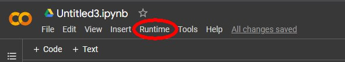
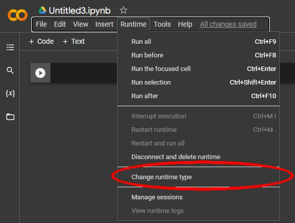
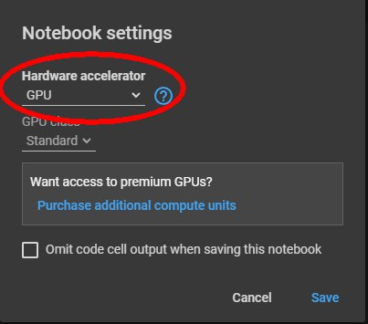
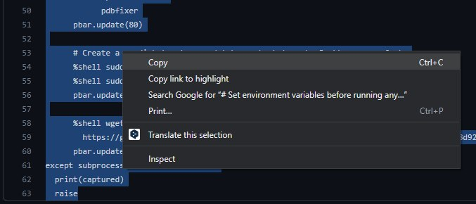
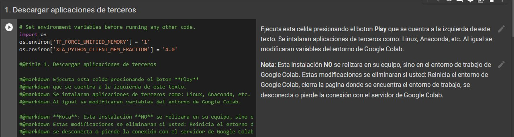
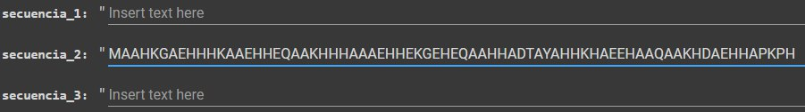
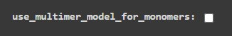

# AlphaFold

## Descripción
Este google colab de una versión simplificada de AlphaFold permite ingresar hasta 20 secuencias de aminoácidos. Este hace una búsqueda de secuencias similares en diferentes bases de datos y posteriormente una predicción de la estructura tridimensional de la proteína resultante.

## Pasos a seguir

Se hará uso del entorno de trabajo de Google Colab, para ello se tendrán que realizar los siguientes pasos:

### 1. Iniciar un nuevo entorno de trabajo

Para iniciar un nuevo cuaderno de trabajo en Google Colab se debe ingresar al siguientes [link](https://colab.research.google.com/?hl=es)

Lo primero que debemos tener en cuenta es si el enterno de trabajo se encuentra utilizando la GPU, para ello damos click en la opcion "Runtime" arriba a la izqueirda:

Después en Change runtime type:

Y posteriormente revisar que el Hardware accelerator se encuentre en GPU (No debe seleccionar None o TPU), sino ocasionará un error a la hora de ejecutar el código:

### 2. Instalación de programas

#### 2.1. Aplicaciones de terceros

Luego de verificar el tipo de procesador el cual se esté utilizando (GPU), se puede iniciar a
[Instalar dependencias en este link](Archives/Descarga_de_dependencias.txt), debe de copiar el código que se encuentra dentro del mismo y pegarlo en una celda de Google Colab:

Posteriormente ejecute el código de la celda que acaba de pegar.

#### 2.2. Descarga de AlphaFold

Luego de descargar los archivos de terceros se procede a la [instalación de AlphaFold](Archives/Descargar_de_AlphaFold.txt/). Debe repetir los mismos pasos que en el inciso anterior (Copiar el código y pegarlo en una nueva celda de Google Colab).

Para crear una nueva celda en Google Colab, podemos usar el atajo de teclado Control + M + B. Automáticamente agrega una celda.

### 3 Comenzar con la predicción
#### 3.1 Definir secuencias y modelo
Para iniciar la predicción debe de copiar el contenido de [este archivo](Archive/Hacer_prediccion) y pegarlo en una nueva celda de Google colab. Luego debe proporcionar en el espacio indicado la secuencia(s) de aminoácido(s) a la que usted desea conocer su estructura tridimensional: 

Si solamente se inserta una sola entrada se usará el modelo Monomer, si proporcionas multiples entradas, será usado el modelo Multimer. Si se quiere utilizar el modo multimer para una sola entrada se debe activar la casilla use_multimer_model_for_monomers.

#### 3.2 Busqueda en la base de datos

Despues de indicar la secuencia copie, pegue y ejecute el [siguiente archivo](Archives/Busqueda_y_prediccion_en_la_base_de_datos.txt) para que las secuencias suministradas sean comparadas con la base de datos de AlphaFold, verá estadísticas sobre la alineación de secuencia múltiple (MSA) que utilizará AlphaFold. En particular, verá qué tan bien cada residuo está cubierto por secuencias similares en el MSA.

### 4. Predicción

En el siguiente [archivo](Archives/Ejecutar_AlphaFold_y_ver_prediccion.txt) encontrará el código necesario para la ejecución de de AlphaFold y la posterior visualización de la(s) prediccion(es).

## Integrantes:

Universidad Nacional de Colombia
Sede de La Paz

### Luis Angel Peña Diaz - Estudiante de pregrado en Ingeniería Mecatrónica - [lpenad@unal.edu.co](lpenad@unal.edu.co)
### Hugo Francinsco Rincon Lopez - Estudiante de pregrado en Ingeniería Mecatrónica - [hufrinconlo@unal.edu.co](hufrinconlo@unal.edu.co) 
### Wilhelm David Buitrago Garcia - Estudiante de pregrado en Ingeniería Mecatrónica - [wibuitragog@unal.edu.co](wibuitragog@unal.edu.co)
